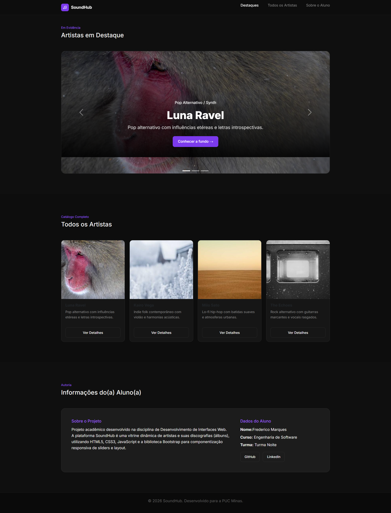

[](https://classroom.github.com/a/449xHS0j)

# Trabalho Prático - Semana 11

## Informações Gerais

- Nome: Frederico Marcos de Paula Marques
- Matricula: 907680

## Prints do trabalho

### Estrutura JSON utilizada

```javascript
const artistas = [
    { 
        id: 1, 
        nome: "Luna Ravel",
        descricao_curta: "...",
        descricao_longa: "...",
        genero: "...",
        origem: "...",
        ano_inicio: 2018,
        destaque: true,
        imagem_principal: "...",
        imagem_thumb: "...",
        albuns: [...] }
];
```

### Print da home-page



### Print da página de detalhes

